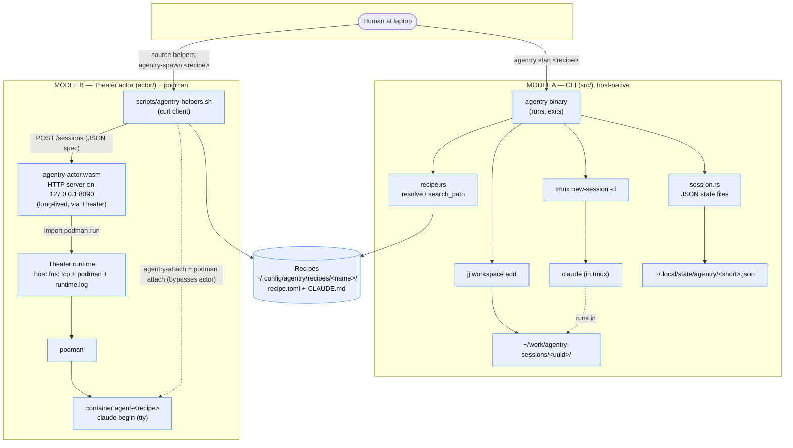
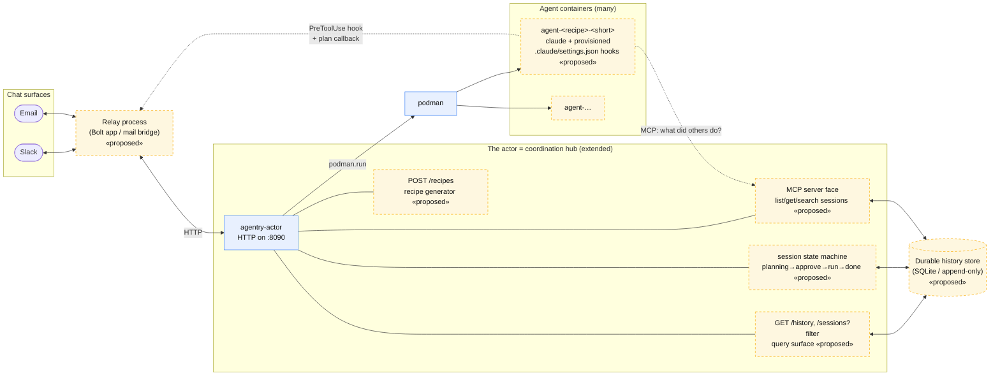
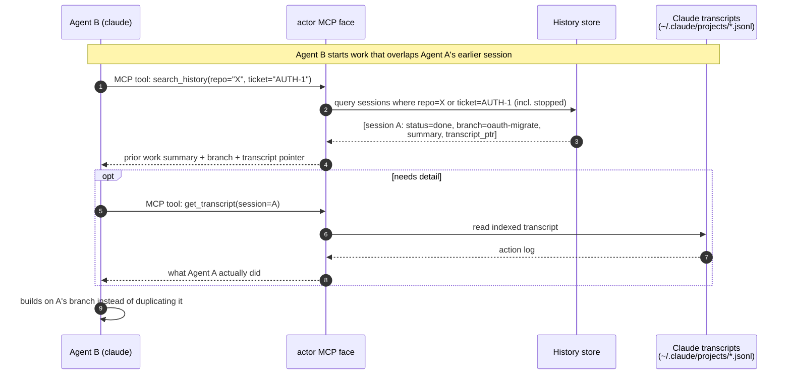
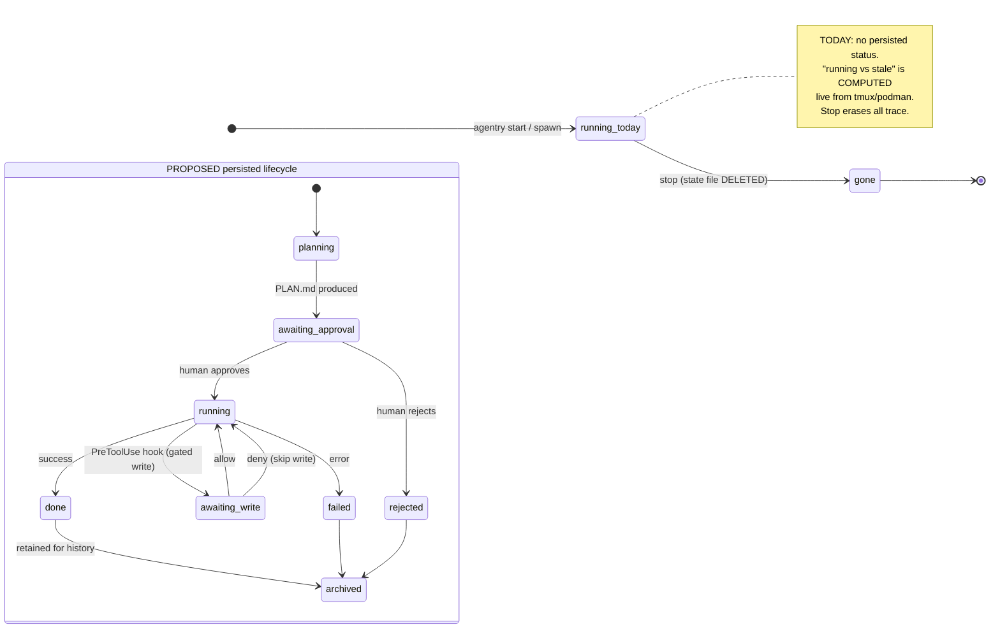
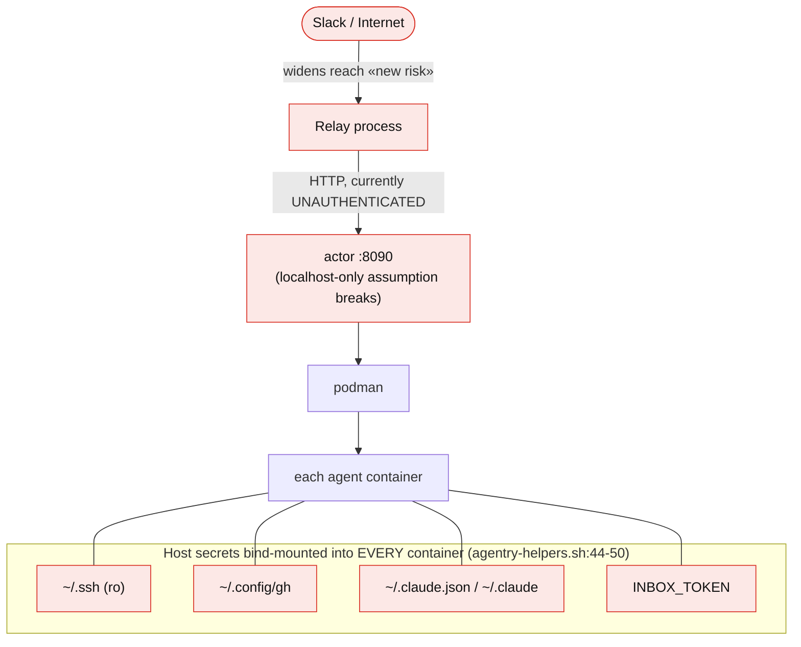

# agentry — Architecture & Flow Diagrams

> Companion to [`PROJECT_CONTEXT.md`](./PROJECT_CONTEXT.md). Diagrams are Mermaid; render on GitHub,
> in Obsidian, or any Mermaid-aware viewer.
>
> **Legend for status:** solid boxes / lines = **exists today**. Dashed boxes / lines and the
> `«proposed»` tag = **the extension to be scoped** (not yet built). This split matches Parts IX+ of
> the context doc.

---

## 1. Current architecture — the two models (as-built)



**Read this as:** two independent ways to launch the same agent (`claude`). Model A isolates with a
jj workspace + tmux and tracks state in JSON files it deletes on stop. Model B isolates with a podman
container and treats podman's live container list as the only source of truth. The actor is the only
long-lived process in either model.

---

## 2. Target topology — Slack/email multi-agent («proposed»)



**Key idea:** the existing actor becomes the hub. Everything new (recipe generation, an approval
state machine, a durable+queryable history store, an MCP face for agents, and a chat relay) clusters
around that single coordination point. Agents talk *back* to the human through the relay (via hooks)
and to *each other* through the MCP/history face.

---

## 3. Sequence — Steps 1→4 end to end («proposed»)

Prompt → generated recipe → approval → guarded execution with write notifications.

```mermaid
sequenceDiagram
    autonumber
    actor U as User (Slack)
    participant R as Relay (Bolt)
    participant A as agentry-actor (:8090)
    participant L as Claude (recipe generator)
    participant P as podman
    participant C as Agent container (claude)
    participant S as History store

    Note over U,S: STEP 1–2 · prompt → agent-friendly recipe
    U->>R: "/agent new: migrate auth to OAuth in repo X"
    R->>A: POST /recipes {prompt}
    A->>L: meta-prompt (emit schema: role, allowed_tools,<br/>output_contract="write PLAN.md then stop", escalation_rules)
    L-->>A: recipe.toml + CLAUDE.md
    A->>A: write to search path; status=planning
    A-->>R: recipe id + summary
    R-->>U: "Recipe 'oauth-migrate' ready. Generate a plan?"

    Note over U,S: STEP 3 · plan, then human accepts the critical path
    U->>R: 👍 generate plan
    R->>A: POST /sessions {recipe, phase:plan}
    A->>P: podman.run (mount .claude + settings.json hooks)
    P->>C: claude begin
    C->>C: produce /workspace/PLAN.md, then exit
    C-->>A: container exit (phase 1 done)
    A->>S: persist session + PLAN.md ; status=awaiting_approval
    A-->>R: PLAN.md
    R-->>U: render plan + [Approve] [Reject]
    U->>R: Approve
    R->>A: POST /sessions/<id>/approve
    A->>P: podman.run (phase:execute) ; status=running

    Note over U,S: STEP 4 · writes are notified/gated as they happen
    C->>C: about to Write/Edit/Bash
    C->>R: PreToolUse hook → diff (via relay webhook)
    R-->>U: "Agent wants to write auth.rs — [Allow] [Deny]"
    U->>R: Allow
    R-->>C: hook decision = allow
    C->>C: perform write
    C-->>A: phase done (branch/commit + summary)
    A->>S: status=done ; record outcome + transcript pointer
    A-->>R: done
    R-->>U: "✅ oauth-migrate finished — branch oauth-migrate, PR #123"
```

**Where each requirement lives:**
- **1–2** → `POST /recipes` + a meta-prompt that emits a *constrained schema* (that constraint is the
  "fitting").
- **3** → two-phase spawn: phase 1 writes `PLAN.md` and exits; the actor gates on human approval
  before phase 2. Requires the **new persisted `status`** field.
- **4** → a **Claude Code `PreToolUse` hook** (provisioned by agentry into the mounted
  `.claude/settings.json`) that round-trips through the relay. Blocking = gate; non-blocking =
  notify-only.

---

## 4. Sequence — one agent cross-references another's work («proposed»)



**Prerequisites this depends on (all «proposed», see PROJECT_CONTEXT Part XI):**
1. State becomes **durable / append-only** — `stop` must stop *deleting* records (today: `cmd.rs:226`
   deletes; `podman rm` makes containers vanish).
2. Records **enriched with work product** — branch/commit, summary, transcript pointer.
3. A **query surface** on the actor (`/history`, filters).
4. Agents get a **client** — the actor exposed as an **MCP server** so `claude` can call it as tools.

The join keys are `repo`, and `linked_ticket` (already a field, `session.rs:26`) generalized to also
cover `linked_thread`.

---

## 5. State machine — a session's lifecycle (today vs proposed)



**The gap in one picture:** today a session is a two-state, trace-erasing thing (exists → gone). The
extension needs a **persisted, multi-state lifecycle** whose terminal states are *archived, not
deleted* — that retention is exactly what makes cross-referencing (§4) possible.

---

## 6. Trust / blast-radius view (security, «to threat-model»)



**Why this matters:** today the `:8090` API is unauthenticated because it is localhost-only and
single-user. A Slack relay that can reach it — combined with every container mounting `~/.ssh`,
`gh`, and Claude credentials — means a prompt-injected or misbehaving agent has a wide blast radius.
This is Part XIII #6 in the context doc and should be threat-modeled before build: authenticate the
API, scope per-agent credentials, and reconsider the ambient secret mounts.

---

## How to keep these in sync

These diagrams encode the design in [`PROJECT_CONTEXT.md`](./PROJECT_CONTEXT.md). When a proposed
piece gets built, move its node/edge from the dashed `«proposed»` style to the solid `exists` style,
and update the corresponding Part in the context doc.
